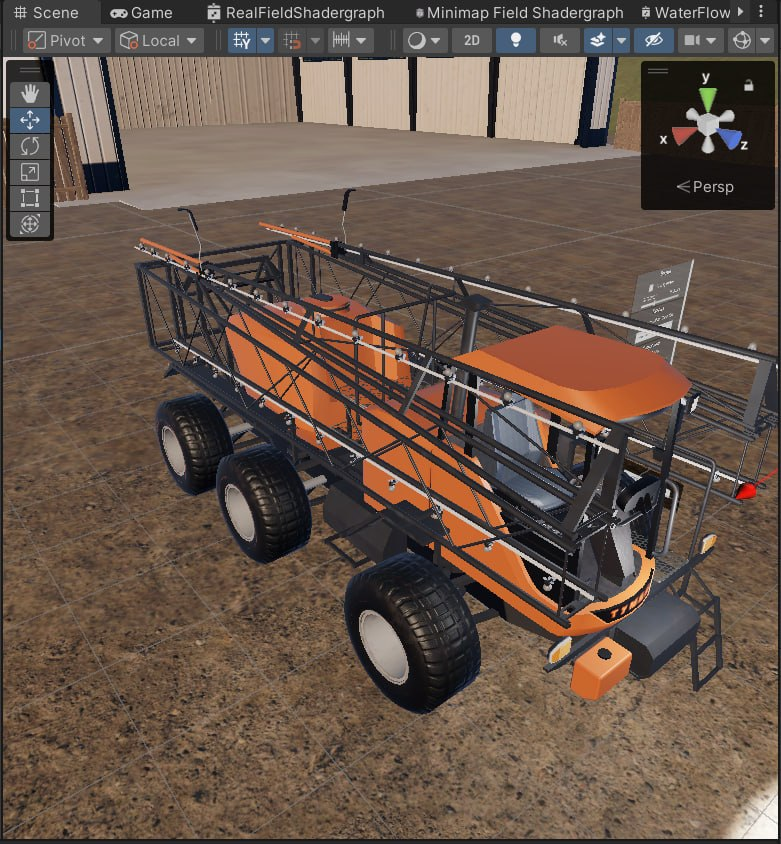
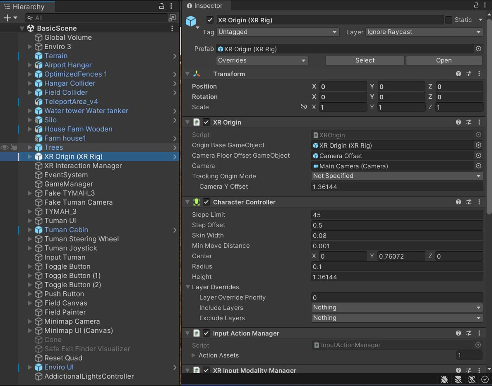
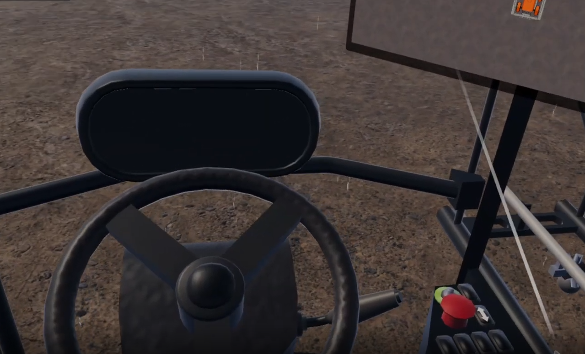
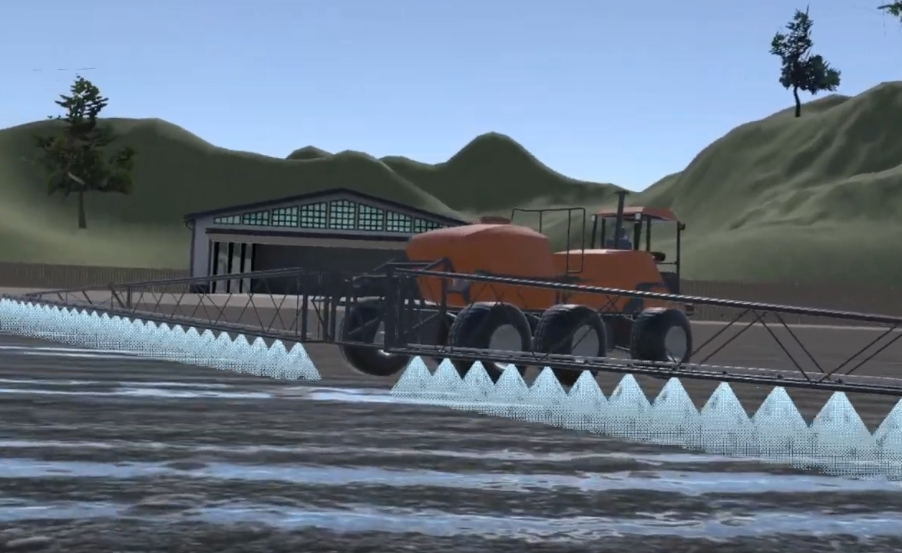

# 🚜 Виртуальный тренажёр управления опрыскивателем «Туман» (TumanXR)


> **Краткое описание:** Проект представляет собой симулятор (ПК и VR), предназначенный для обучения операторов-механизаторов эффективному и безопасному управлению самоходным опрыскивателем-разбрасывателем линейки «Туман» (производства «Пегас-Агро»). Проект выполняется в качестве задания по практике. Данный репозиторий зеркалируется/копируется в официальный репозиторий Цифровой Кафедры университета[cite: 6].


*Рис. 1: Главное меню или общий вид 3D-модели опрыскивателя «Туман» на виртуальном полигоне.*

---

## 📑 Оглавление
1. [Цели и задачи проекта](#-цели-и-задачи-проекта)
2. [Структура проекта](#-структура-проекта)
3. [Используемые технологии](#-используемые-технологии)
4. [Интерфейс и процесс обучения](#-интерфейс-и-процесс-обучения)
5. [Схема управления](#-схема-управления-ввод)
6. [Установка и запуск](#-установка-и-запуск-проекта)

---

## 🎯 Цели и задачи проекта

* **Формирование базовых навыков:** Отработка вождения, маневрирования и позиционирования крупногабаритной спецтехники на виртуальном полигоне[cite: 6].
* **Технологические операции:** Освоение алгоритмов раскладывания/складывания штанг, настройки норм вылива и контроля расхода рабочей жидкости[cite: 6].
* **Изучение интерьера и приборов:** Знакомство с эргономикой кабины, физической приборной панелью, бортовым компьютером и элементами навигационного оборудования[cite: 6].
* **Безопасность производства:** Симуляция нештатных ситуаций (переворот, препятствия, поломка оборудования) в полностью безопасной виртуальной среде[cite: 6].

---

## 📂 Структура проекта

Для поддержания порядка в репозитории используется строгая иерархия папок:

```text
📦 Assets
 ┣ 📂 Models       # Высокополигональные исходники и Low-Poly оптимизированные модели «Туман»
 ┣ 📂 Prefabs      # Преднастроенные игровые объекты (кабина, штанги, колеса)
 ┣ 📂 Scenes       # Игровые пространства (главное меню, полигон, экзаменационное поле)
 ┣ 📂 Scripts      # Исходный код логики симулятора, физики и XR-взаимодействия
 ┗ 📂 UI           # Графические элементы интерфейса, меню настроек и подсказок

---
```
## 🛠 Используемые технологии

| Компонент / Модуль | Назначение в проекте |
| --- | --- |
| **Unity Editor (2022.3.53 LTS)** | Основная среда разработки и рендеринга проекта.

 |
| **OpenXR API** | Базовый интерфейс для работы с виртуальной реальностью.

 |
| **Unity XRI (XR Interaction Toolkit)** | Инструментарий для обработки взаимодействий (захват, нажатия) в VR-среде.

 |
| **Blender / 3ds Max / Maya** | Инструменты 3D-моделирования и оптимизации ассетов.

 |
```
```

*Рис. 2: Иерархия сцены и настройка компонентов XR Origin / Vehicle Controller в редакторе Unity.*

---

## 🖥 Интерфейс и процесс обучения

Основа тренажёра — это детализированная кабина с интерактивными элементами. Механизатор может взаимодействовать с бортовым компьютером и тумблерами как с помощью мыши, так и виртуальными руками в VR-шлеме.


*Рис. 3: Вид от первого лица (FPS/VR): приборная панель, руль и бортовой навигатор.*

При выполнении заданий симулируется физика машины и визуализируется процесс распыления рабочей жидкости на поле.


*Рис. 4: Демонстрация работы штанг и системы вылива (Particle Systems) во время движения по полю.*

---

## 🎮 Схема управления (Ввод)

Проект поддерживает как классическое управление с ПК, так и полное погружение через VR-гарнитуры.

| Режим ввода | Действие / Элемент управления | Описание взаимодействия |
| --- | --- | --- |
| **ПК (Клавиатура + Мышь)** | `W`, `A`, `S`, `D` | Управление движением, ускорением и торможением |
|  | `Движение мыши` | Свободный обзор внутри и снаружи кабины опрыскивателя |
|  | `ЛКМ` (Левая кнопка мыши) | Взаимодействие с активными кнопками, тумблерами и дисплеями |
| **VR (Контроллеры)** | `Grip` (Боковой триггер) | Физический захват рулевого колеса, рычагов и джойстика |
|  | `Trigger` (Передний триггер) | Активация интерфейсов бортового компьютера, нажатие кнопок пальцем |

---

🚀 Установка и запуск проекта
Клонирование репозитория:
```
```Bash
git clone [https://github.com/TheFox3490/TumanXR.git](https://github.com/TheFox3490/TumanXR.git)
```
Инициализация в среде: Откройте корневую папку через Unity Hub. Обязательно используйте установленную версию редактора Unity 2022.3.53[cite: 6].

Импорт зависимостей: Дождитесь окончания автоматического импорта пакетов OpenXR и внутренних ассетов проекта[cite: 6].

Запуск сцены: Перейдите в каталог Assets/Scenes/ и откройте стартовую сцену (MainScene.unity)[cite: 6].

Тестирование VR: Перед запуском режима Play в редакторе убедитесь, что среда выполнения VR (SteamVR, Oculus App или Meta Quest Link) активна и шлем корректно инициализирован в системе[cite: 6].
